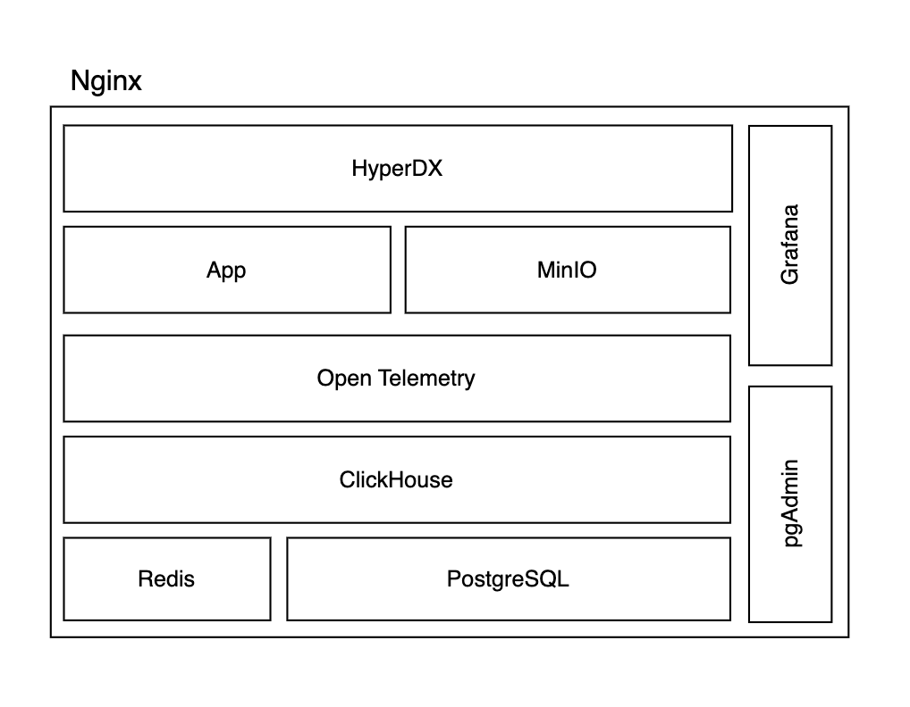
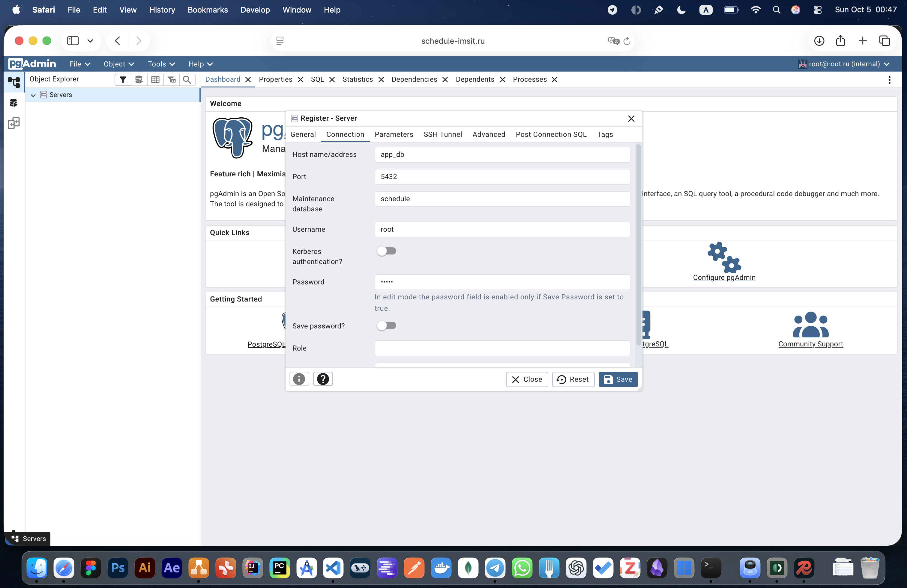
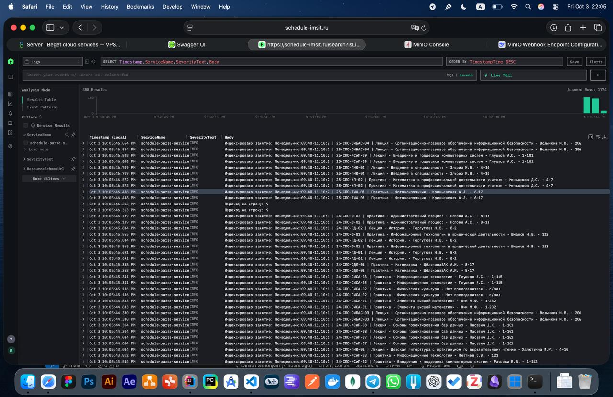
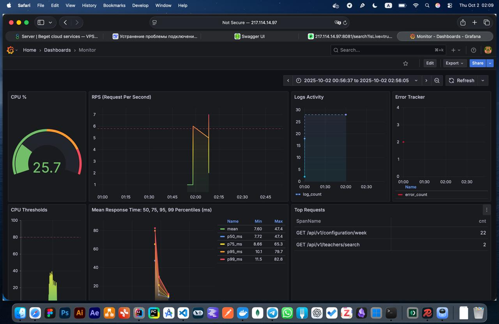

# Schedule Parse Service

Сервис автоматически парсит расписание когда вы сохраняете его в указанный бакет MinIO в Excel формате. Предоставляет API для интеграции с [клиентом](https://github.com/simadimonyan/electronic-schedule-app) по защищенному соединению. Позволяет отслеживать состояние нагрузки системы в реальном времени.


## Стек технологий

1. Java 
2. Spring: Web, Data, Security, Actuator
3. ApachePOI
4. PostgreSQL
5. Redis
6. MinIO
7. Open Telemetry 
8. Micrometer
9. ClickHouse
10. Docker

## Установка и настройка

1. Клонируйте репозиторий:
    ```
    git clone https://github.com/simadimonyan/schedule-parse-system.git
    cd schedule-parse-service
    ```

2. Отредактируйте `.env` и `application.properties`. Для production дополнительно настройте `grafana.ini` и `compose.yaml`. Следуйте комментариям в коде. При наличии доменного имени указывать его по url в соответствии с комментариями.
3. Если используется HTTP, закомментируйте строки для nginx в `compose.yaml`. Для HTTPS (если у вас нет сертификатов):

4. Создайте сертификаты через certbot и локальный nginx вне Docker.
Поместите сертификаты в `volumes/nginx/ssl` (обновлять каждые 3 месяца), если этой папки нет - создайте ее.
Отредактируйте `configs/nginx/nginx.conf`.
Настройте автообновление сертификатов через crontab. Откройте файл crontab. Выполните следующую команду в терминале:

```
crontab -e
```
5. Это откроет файл crontab в текстовом редакторе. Добавьте строку. В самом низу файла добавьте команду для cron проверки обновления сертификатов дважды в день:
```
0 0,12 * * * /usr/bin/certbot renew --cert-path /schedule-parse-service/volumes/nginx/ssl/fullchain.pem --key-path /schedule-parse-service/volumes/nginx/ssl/privkey.pem --post-hook "docker exec nginx nginx -s reload"
```

6. Отредактируйте конфигурационный файл journald (для предотвращения переполнения памяти диска):

```
bash
sudo nano /etc/systemd/journald.conf
```

7. Найдите и измените (или добавьте) строку:

```ini
[Journal]
SystemMaxUse=100M
```



### Переменные окружения

Ниже приведены основные переменные окружения, используемые сервисом. Укажите их значения в файле `.env` или соответствующих конфигурациях.

| Переменная | Описание |
|------------|----------|
| `POSTGRES_USER` | Имя пользователя для подключения к PostgreSQL |
| `POSTGRES_PASSWORD` | Пароль пользователя PostgreSQL |
| `POSTGRES_DB` | Имя базы данных PostgreSQL |
| `REDIS_USER_PASSWORD` | Пароль для подключения к Redis |
| `MINIO_ROOT_USER` | Имя root-пользователя MinIO |
| `MINIO_ROOT_PASSWORD` | Пароль root-пользователя MinIO (должен содержать цифры, спецсимволы и буквы разных регистров) |
| `MINIO_WEBHOOK_AUTH_TOKEN` | Токен авторизации для вебхука MinIO (используется для интеграции с сервисом) |
| `PGADMIN_DEFAULT_EMAIL` | Email для входа в pgAdmin |
| `PGADMIN_DEFAULT_PASSWORD` | Пароль для входа в pgAdmin |
| `CLICKHOUSE_USER` | Имя пользователя ClickHouse |
| `CLICKHOUSE_PASSWORD` | Пароль пользователя ClickHouse |
| `HYPERDX_API_URL` | URL для подключения к HyperDX API (заменить на доменное имя в production) |
| `HYPERDX_API_PORT` | Порт HyperDX API |
| `HYPERDX_APP_URL` | URL для подключения к приложению HyperDX (заменить на доменное имя в production) |
| `HYPERDX_APP_PORT` | Порт приложения HyperDX |
| `FRONTEND_URL` | URL фронтенда (указать доменное имя в production) |
| `MINIO_SERVER_URL` | URL сервера MinIO |
| `MINIO_BROWSER_REDIRECT_URL` | URL для доступа к веб-интерфейсу MinIO (`/console` для production) |
| `GF_SECURITY_ADMIN_USER` | Имя администратора Grafana |
| `GF_SECURITY_ADMIN_PASSWORD` | Пароль администратора Grafana |

### Запуск

```bash
sudo docker compose up
```
При проблемах с правами доступа, где pgAdmin и grafana бесконечно перезапускаются, выполните:
```bash
sudo chmod -R 777 ./volumes
```

### Настройка MinIO и приложения

1. `docker exec -it minio /bin/sh`
2. `bash minio-generate-keys.sh` (адрес сервера: http://minio:9000)
3. Перейдите в `/src/main/resources`
4. Отредактируйте `application.properties` с новыми ключами.
5. Перезапустите приложение: `docker restart app`
6. Дождитесь запуска сервиса `app`
7. `docker exec -it minio /bin/sh`
8. `bash minio-init-webhook.sh` (повторять с шага 7 при перезапуске app)

### Настройка API

Инициализируйте четность недели через Swagger:
```
POST /api/v1/configuration/week/swap
Authorization: Bearer <access-token> (application.properties)

Body:
Bearer <admin-token> (application.properties)
```

### Настройка pgAdmin



- Подключитесь к базе данных через интерфейс pgAdmin. (адрес: app_db)

### Настройка HyperDX



- Измените доменное имя в `.env`.
- Подключите ClickHouse. (адрес: http://clickhouse:8123)
- При ошибках подключения к базе — перезапустите сервис `clickhouse`.

### Настройка Grafana для работы с subpath (production)



1. Откройте файл `configs/grafana/grafana.ini`.
2. Найдите и отредактируйте параметры:
    - Установите параметр `root_url` с subpath `/grafana`
    - Убедитесь, что `serve_from_sub_path = true`.
3. Для production:
    - Откройте `compose.yaml`.
    - Удалите строки с портами, чтобы исключить прямой доступ и повысить безопасность соединений.

- Добавьте плагин ClickHouse.
- Добавьте datasource (адрес: clickhouse)
- Импортируйте дашборд из `/configs/grafana/MonitorDashboard.json`.
- При ошибках подключения — перезапустите сервис базы `clickhouse`.

## URL

### Адреса для production (пример: schedule-imsit.ru)

- HyperDX: https://schedule-imsit.ru
- MinIO: https://schedule-imsit.ru/console/
- pgAdmin: https://schedule-imsit.ru/pgadmin/
- Grafana: https://schedule-imsit.ru/grafana/
- API Swagger: https://schedule-imsit.ru/schedule/
- Redis: tcp://schedule-imsit.ru:6379

### Адреса для теста

- Swagger API: http://localhost:8080
- HyperDX: http://localhost:8081
- MinIO: http://localhost:9001
- Grafana: http://localhost:3000
- pgAdmin: http://localhost:15432
- Redis: http://localhost:6380
- PostgreSQL: http://localhost:5432

### Безопасность

- Запросы с одного IP: 10 r/s
- TCP соединения с одного IP: 2
- Кеширование ответов с кодом 200: 10 минут
- Время хранения логов, метрик и трассировок: 48 часов