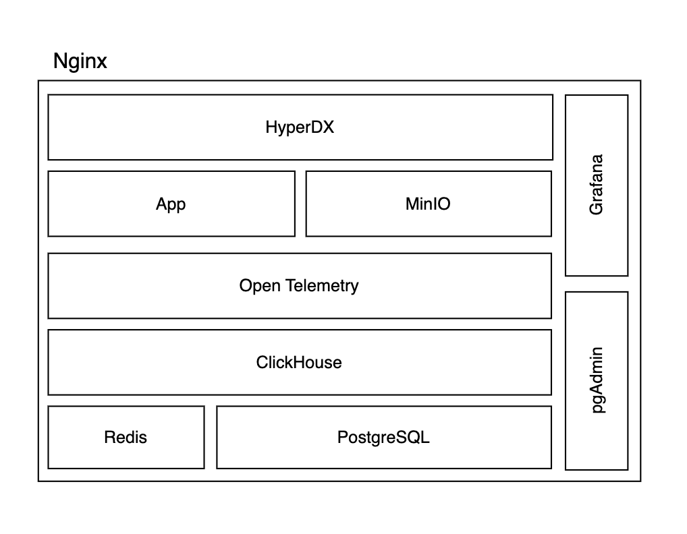
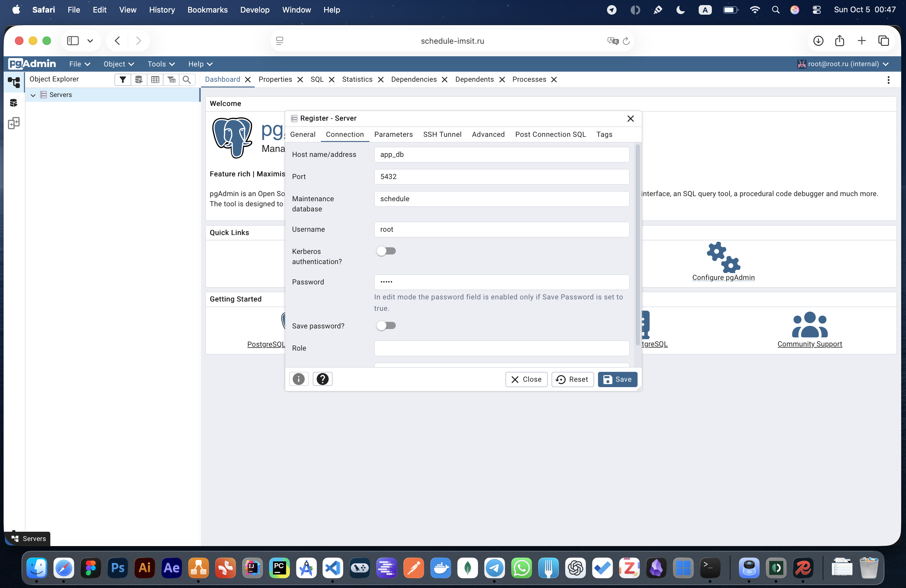
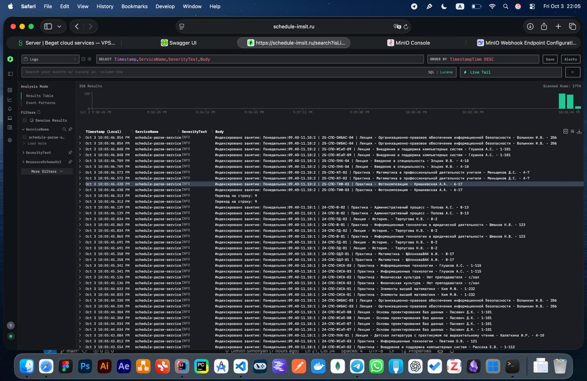
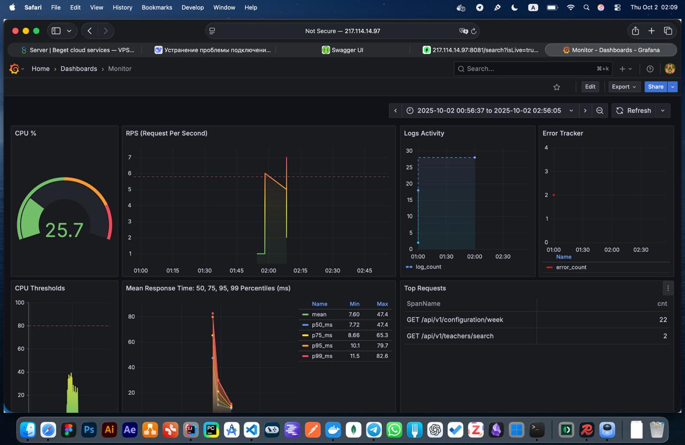

# Schedule Parse Service

Сервис автоматически парсит расписание когда вы сохраняете его в указанный бакет MinIO в Excel формате. Предоставляет API для интеграции с [клиентом](https://github.com/simadimonyan/electronic-schedule-app) по защищенному соединению. Позволяет отслеживать состояние нагрузки системы в реальном времени.


## Стек технологий

1. Java 
2. Spring: Web, Data, Security, Actuator
3. ApachePOI
4. PostgreSQL
5. Redis
6. MinIO
7. Open Telemetry 
8. Micrometer
9. ClickHouse
10. Docker

## Установка и настройка

1. Клонируйте репозиторий:
    ```
    git clone https://github.com/simadimonyan/schedule-parse-system.git -b production
    cd schedule-parse-service
    ```

2. Отредактируйте `.env` и `application.properties`. Для production дополнительно настройте `grafana.ini` и `compose.yaml`. Следуйте комментариям в коде. При наличии доменного имени указывать его по url в соответствии с комментариями.
3. Если используется HTTP, закомментируйте строки для nginx в `compose.yaml`. Для HTTPS (если у вас нет сертификатов):

4. Создайте сертификаты через `bash init-certs.sh`

5. Отредактируйте конфигурационный файл journald (для предотвращения переполнения памяти диска):

```bash
sudo nano /etc/systemd/journald.conf
```

6. Найдите и измените (или добавьте) строку:

```ini
[Journal]
SystemMaxUse=100M
```



### Переменные окружения

Ниже приведены основные переменные окружения, используемые сервисом. Укажите их значения в файле `.env` или соответствующих конфигурациях.

| Переменная | Описание |
|------------|----------|
| `POSTGRES_USER` | Имя пользователя для подключения к PostgreSQL |
| `POSTGRES_PASSWORD` | Пароль пользователя PostgreSQL |
| `POSTGRES_DB` | Имя базы данных PostgreSQL |
| `REDIS_USER_PASSWORD` | Пароль для подключения к Redis |
| `MINIO_ROOT_USER` | Имя root-пользователя MinIO |
| `MINIO_ROOT_PASSWORD` | Пароль root-пользователя MinIO (должен содержать цифры, спецсимволы и буквы разных регистров) |
| `MINIO_WEBHOOK_AUTH_TOKEN` | Токен авторизации для вебхука MinIO (используется для интеграции с сервисом) |
| `PGADMIN_DEFAULT_EMAIL` | Email для входа в pgAdmin |
| `PGADMIN_DEFAULT_PASSWORD` | Пароль для входа в pgAdmin |
| `CLICKHOUSE_USER` | Имя пользователя ClickHouse |
| `CLICKHOUSE_PASSWORD` | Пароль пользователя ClickHouse |
| `HYPERDX_API_URL` | URL для подключения к HyperDX API (заменить на доменное имя в production) |
| `HYPERDX_API_PORT` | Порт HyperDX API |
| `HYPERDX_APP_URL` | URL для подключения к приложению HyperDX (заменить на доменное имя в production) |
| `HYPERDX_APP_PORT` | Порт приложения HyperDX |
| `FRONTEND_URL` | URL фронтенда (указать доменное имя в production) |
| `MINIO_SERVER_URL` | URL сервера MinIO |
| `MINIO_BROWSER_REDIRECT_URL` | URL для доступа к веб-интерфейсу MinIO (`/console` для production) |
| `GF_SECURITY_ADMIN_USER` | Имя администратора Grafana |
| `GF_SECURITY_ADMIN_PASSWORD` | Пароль администратора Grafana |
| `MASTER_SERVICE_URL` | Адрес мастер-сервиса (по умолчанию `http://master_app:8080`) |
| `MASTER_SERVICE_TIMEOUT` | Таймаут обращения к мастер-сервису, секунды (по умолчанию 10) |
| `MASTER_DEFAULT_FACULTY_ID` | Факультет, под которым группы заводятся в справочнике |
| `KAFKA_BOOTSTRAP_SERVERS` | Адрес брокера Kafka (по умолчанию `kafka:9092`) |
| `MASTER_CACHE_TOPIC` | Топик событий справочников (по умолчанию `redis-cache-process`) |
| `CACHE_TTL` | Срок жизни записей кеша (по умолчанию `1h`) |
| `CACHE_PREFIX` | Префикс ключей сервиса в общем Redis (по умолчанию `schedule:`) |

### Запуск

```bash
sudo docker compose up
```
При проблемах с правами доступа, где pgAdmin и grafana бесконечно перезапускаются, выполните:
```bash
sudo chmod -R 777 ./volumes
```

### Настройка MinIO и приложения

1. `docker exec -it minio /bin/sh`
2. `bash minio-generate-keys.sh` (адрес сервера: http://minio:9000)
3. Перейдите в `/src/main/resources`
4. Отредактируйте `application.properties` с новыми ключами.
5. Перезапустите приложение: `docker restart app`
6. Дождитесь запуска сервиса `app`
7. `docker exec -it minio /bin/sh`
8. `bash minio-manual-init-webhook.sh` (повторять с шага 7-8 при перезапуске app)

9. Для того, чтобы защитить сервер от переполнения памяти необходимо настроить первичные данные для скрипта перезагрузки и очистки сервисов (очищает volume clickhouse и кеш docker контейнеров):

```bash
# 1. Добавьте сгенирированные на шаге 2 MinIO ключи по переменным MINIO_ACCESS_KEY и MINIO_SECRET_KEY на строчках 11 и 12
# 2. Добавьте ваш URL с subpath к сервису для функции wait_for_service на строчках 146 и 147
nano restart-services.sh
```

10. Настройте автоочистку и перезапуск через crontab. Откройте файл crontab. Выполните следующую команду в терминале:

```bash
crontab -e
```

11. Это откроет файл crontab в текстовом редакторе. Добавьте строку. В самом низу файла добавьте команду для cron автоочистки и перезапуска сервисов каждые 12 часов (начиная с 01:00):
```
0 1,12 * * * /usr/bin/bash /root/schedule-parse-system/restart-services.sh  
```

## Интеграция с мастер-сервисом

Мастер-сервис — владелец справочников ISMS. Своих копий справочника расписание не держит:
таблиц `group_table` и `teacher_table` больше нет, пара ссылается на группу и преподавателя
идентификаторами мастера (`group_master_id`, `teacher_master_id`). Локальной таблицы
соответствий тоже нет — единственный источник и для имён, и для идентификаторов сам мастер.

Файл расписания знает записи по имени, а у мастера чтения по имени нет: есть `list/batch` по
идентификаторам и `resolve/batch` — поиск по естественному ключу. Значит, перевод имени в
идентификатор — сетевой вызов, и мастер стоит на пути чтения расписания. Смягчает это кеш
сервиса: результат резолва живёт в регионе `directory` в Redis столько же, сколько остальные
ответы, и сбрасывается теми же событиями. Промах стоит одного запроса к мастеру, попадание —
ни одного.

**Расписание → мастер.** Группы и преподаватели, встреченные в файле, ищутся в справочнике
(`POST /api/v1/{groups,teachers}/resolve/batch`), а ненайденные заводятся
(`POST .../create/batch`). Тот же поиск заменяет и учёт уже отправленного: предметы с
аудиториями не шлются заново, потому что создаётся только то, чего в справочнике не нашлось.
Это происходит **до** вставки строк расписания, а не после коммита: пара хранит группу идентификатором, и
без него её негде записать. Если мастер не отдал идентификатор группы, её расписание из
этого файла не сохраняется — в лог уходит `ERROR` со списком групп, а записи появятся при
повторной загрузке файла. Преподаватель для сохранения не обязателен: несвязанный оставит
поле пустым, но саму пару не отменит. Предметы и аудитории синхронизируются уже после
записи — в паре они хранятся строками, и от них вставка не зависит.

Сетевые вызовы вынесены за границы транзакции и идут в фоновом потоке разбора: соединение с
базой держит только сама вставка.

**Мастер → расписание.** Сервис слушает топик Kafka `redis-cache-process`. Делать по событию
почти нечего: пары ссылаются на идентификаторы, а название, курс, уровень и форма обучения
попадают в выдачу прямо из справочника. Устареть может только кеш — его и сбрасываем целиком,
вместе с переводами имён в идентификаторы. Переименование группы после этого подхватывается
само, удаление — тоже: удалённую запись `resolve/batch` не возвращает.

Читаются данные не по HTTP, а из общего кеша мастера в Redis — ключи
`master:group:{id}` и `master:teacher:{id}`, которые мастер сам обновляет при каждой
записи (TTL 1 час). Событие в Kafka как раз и означает, что слепок только что обновлён.
HTTP остаётся запасным путём: промах ключа, чужой формат значения или недоступный Redis
переводят чтение на `list/batch`, а не в ошибку.

Пока ответ лежит в кеше сервиса, недоступность мастера не видна. После истечения TTL она
видна полностью: перевести имя в идентификатор будет нечем, и расписание не найдётся. Это
цена отказа от локальной таблицы соответствий — единственный источник теперь один.

Собственный кеш сервиса (`groups`, `teachers`, `schedule`, `levels`, `courses`, `configs`)
живёт в том же Redis и с версии интеграции имеет TTL — `CACHE_TTL`, по умолчанию час, под
стать TTL мастера. Основной способ обновления по-прежнему явный сброс: при загрузке файла,
при смене чётности недели и по событию из мастера. TTL страхует от записей, до которых
сброс не дошёл.

Redis общий на весь стек, поэтому ключи сервиса отделены префиксом `CACHE_PREFIX`
(по умолчанию `schedule:`) — итоговый ключ выглядит как `schedule:groups::ПИ-301`. Внутри
регионов `schedule` и `teachers` ключи дополнительно размечены по смыслу
(`group:` / `teacher:`, `label:` / `department:`): ключ по умолчанию складывается только
из аргументов метода, без его имени, и запросы расписания группы и преподавателя с
одинаковыми параметрами попадали бы в одну ячейку.

Что нужно знать при настройке:

- **`MASTER_DEFAULT_FACULTY_ID` должен существовать в мастере.** Факультета в файле
  расписания нет, а мастер требует его при создании группы. Все группы заводятся под этим
  факультетом, дальше их можно перераспределить в мастере — расписание примет изменение
  событием.
- **Название группы у мастера уникально глобально.** Заведённую кем-то ещё группу создание
  отклонило бы с `409` без выдачи идентификатора, поэтому перед созданием всегда идёт
  `resolve/batch`: найденная группа подхватывается связью, а создаются только те, которых в
  справочнике действительно нет.
- **Курс, уровень и форма обучения приходят из справочника.** Своей копии у расписания нет,
  поэтому отбор `search?course=&level=` работает по данным мастера. Форму обучения знает
  только расписание (определяет по имени файла) и досылает её мастеру, когда значение там
  отличается. Поле `study_from` у мастера — дата начала обучения, это не она.
- **Списки групп и преподавателей собираются из самих пар.** Группы сервиса — ровно те, чьё
  расписание он хранит; отдельного перечня, живущего своей жизнью, больше нет.
- **Отбор преподавателей по кафедре (`search?department=`) даёт пустую выдачу.** Кафедра в
  представлении преподавателя у мастера не возвращается — как и раньше, когда колонка была,
  но её никто не заполнял.
- **Преподаватель в расписании — строка «Фамилия И.О.»**, у мастера — ФИО по частям. При
  публикации строка разбирается, при чтении собирается обратно. Если инициалов в ячейке
  файла нет, вместо имени в справочник уходит `Н/Д` и в лог пишется предупреждение.
- **Проверки на дубликат у преподавателей мастер не делает** — тёзки нормальны. Поэтому
  перед созданием идёт поиск по фамилии, а кандидаты различаются полным ФИО.
- **Каждая загрузка файла тратит пачку запросов к мастеру на резолв.** Это плата за
  отсутствие локальной таблицы соответствий: сервис заново спрашивает справочник, что из
  встреченного уже заведено. Запросы пакетные, по 500 записей.
- **Старые таблицы и колонки из базы не удаляются автоматически** — `ddl-auto=update` только
  добавляет. После обновления сервис не обращается ни к `group_table`, ни к `teacher_table`,
  ни к прежним внешним ключам `schedule_table` на них; снести их нужно вручную:

  ```sql
  -- колонки внешних ключей на удалённые таблицы; вставке они не мешают (nullable),
  -- но и смысла в них больше нет
  ALTER TABLE schedule_table DROP COLUMN IF EXISTS group_id;
  ALTER TABLE schedule_table DROP COLUMN IF EXISTS teacher_id;
  DROP TABLE IF EXISTS group_table, teacher_table;
  ```

  Порядок важен: пока колонки на месте, внешние ключи не дадут удалить таблицы. Сверьтесь с
  фактической схемой (`\d schedule_table`) — имена колонок зависят от версии, на которой
  база создавалась.

### Настройка API

Инициализируйте четность недели через Swagger:
```
POST /api/v1/configuration/week/swap
Authorization: Bearer <access-token> (application.properties)

Body:
Bearer <admin-token> (application.properties)
```

### Настройка pgAdmin



- Подключитесь к базе данных через интерфейс pgAdmin. (адрес: app_db)

### Настройка HyperDX



- Измените доменное имя в `.env`.
- Подключите ClickHouse. (адрес: http://clickhouse:8123)
- При ошибках подключения к базе — перезапустите сервис `clickhouse`.

### Настройка Grafana для работы с subpath (production)



1. Откройте файл `configs/grafana/grafana.ini`.
2. Найдите и отредактируйте параметры:
    - Установите параметр `root_url` с subpath `/grafana`
    - Убедитесь, что `serve_from_sub_path = true`.
3. Для production:
    - Откройте `compose.yaml`.
    - Удалите строки с портами, чтобы исключить прямой доступ и повысить безопасность соединений.

- Добавьте плагин ClickHouse.
- Добавьте datasource (адрес: clickhouse)
- Импортируйте дашборд из `/configs/grafana/MonitorDashboard.json`.
- При ошибках подключения — перезапустите сервис базы `clickhouse`.

## URL

### Адреса для production (пример: myimsit.ru)

- HyperDX: https://admin.myimsit.ru
- MinIO: https://admin.myimsit.ru/console/
- pgAdmin: https://admin.myimsit.ru/pgadmin/
- Grafana: https://admin.myimsit.ru/grafana/
- API Swagger: https://api.myimsit.ru/schedule/
- Redis: tcp://myimsit.ru:6379

### Адреса для теста

- Swagger API: http://localhost:8080
- HyperDX: http://localhost:8081
- MinIO: http://localhost:9001
- Grafana: http://localhost:3000
- pgAdmin: http://localhost:15432
- Redis: http://localhost:6380
- PostgreSQL: http://localhost:5432

### Безопасность

- Запросы с одного IP: 10 r/s
- TCP соединения с одного IP: 2
- Кеширование ответов с кодом 200: 10 минут
- Время хранения логов, метрик и трассировок: 12 часов